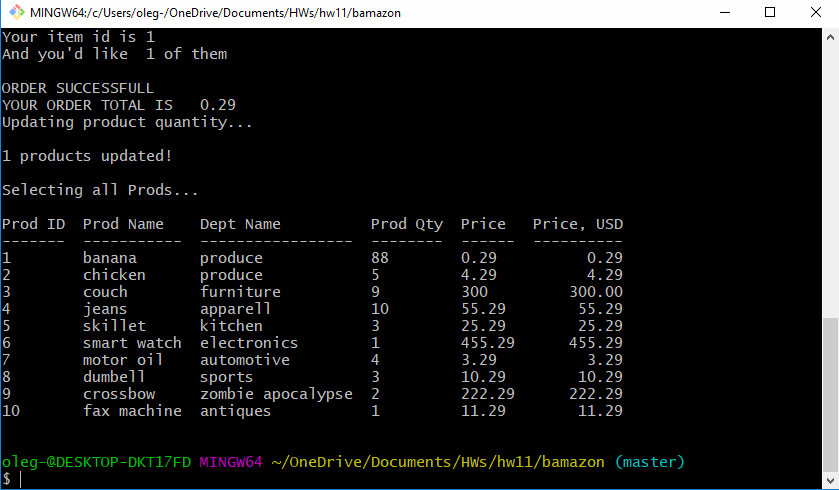

# bamazon
NodeJS CLI app - that demonstrates CRUD with mySQL db

Below GIF runs thru the most basic case scenario: 
1. user gets a list of items upon program execution. Items come from mySQL db.
2. User is prompted to select an item for purchase
3. After selecting a valid item the user is prompted to select an amount of items.
4. Error checking validates that amount is in stock, by checking the DB for quantity on hand.
5. If item's out of stock the user gets an informative message.
6. If item's in stock a sale completion message gets displayed.

